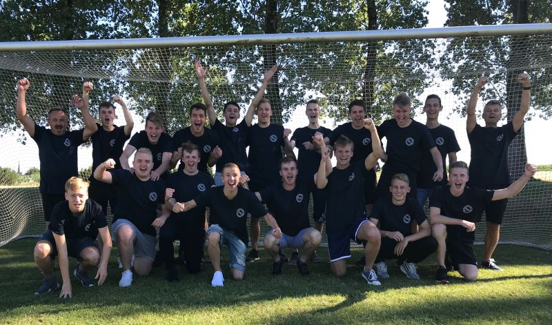

# TSV Neunkirchen / SV Hetzles / 1.FC Dormitz / SV Kleinsendelbach
Die Saison 2017/18 ist vorüber. Bevor es in die neue Spielzeit geht, wollen wir die vergangene Saison, die Licht und Schatten hatte, Revue passieren lassen. Sie SG hatte in der vergangenen Saison, von der U19 bis runter zur U13, 4 Altersklassen am Start. Insgesamt nahmen 6 Mannschaften am Spielbetrieb teil. Auch zur neuen Saison werden wir wieder mit allen 4 Altersklassen in die Saison gehen.

    
    Unsere U19 Mannschaft, frisch gebackener Kreisklassenmeister und KJR- Pokalsieger

## A-Jugend

Die A Jugend startete als Aufsteiger in die neue Saison. Für das Trainerteam um Fritz Müller und Harald Hofmann, stand ein sehr kleiner Kader zur Verfügung, deshalb mußten immer wieder B Jugend Spieler die U19 unterstützen. Alle Beteiligten wußten, dass der Kader gut genug ist, um erneut wieder um den Aufstieg mit zuspielen. Mit eindrucksvollen 49 Punkten und 66:22 Toren, gewann die Mannschaft die Meisterschaft und steigt somit in die höchste Klasse des Spielkreises, in die Kreisliga auf.
Im KJR- Pokal, diesen Pokal spielen alle Jugendmannschaften des Landkreises Forchheim aus, standen unsere Jungs im Finale. Leider sagte der Gegner, Jahn Forchheim, kurzfristig das Spiel ab. Die A Jugend holte somit kampflos auch den KJR-Pokal und darf sich Double Gewinner nennen.
In der neuen Saison bekommt die U19 einen neuen Trainer. Mit Simon Müller übernimmt ein junges Trainertalent, er macht zur Zeit seine C- Lizenz, die Mannschaft. Ihm steht ein spielstarker Kader zur Verfügung, aber als Aufsteiger ist erstmal der Klassenerhalt das oberste Ziel.

## B-Jugend

Auch dem Trainerteam der U17 Mannschaft, Dominik Fabricius und Stefan Beck, stand ein sehr kleiner Kader zur Verfügung, aber mit einem spielstarken Jahrgang wollten beide um die Meisterschaft mitspielen. Nach einer starken Saison erreichte man die Vizemeisterschaft in der Kreisliga.
Wie auch unsere A Jugend, stand auch die B Jugend im KJR-Pokal Finale. Es ging gegen ihren härtesten Ligakontrahenten den Kreisligameister TSV Ebermannstadt. In der Liga trennten sie sich zweimal Unentschieden, aber im Pokalfinale hatten diesmal unsere Jungs die Nase vorne und gewannen mit 1:0.
Das Trainerduo wird auch in der neuen Saison die U17 betreuen. Wie auch bei der A Jugend ist in erster Linie der Klassenerhalt das primäre Ziel.

## C-Jugend

Die U15 Mannschaft, die von Diethard Plöckl und Dominik Hofmann trainiert wurde, gingen in ihre zweite Kreisliga Saison. Wie schon ein Jahr zuvor, ging es für die C Jugend wieder einmal um den Klassenerhalt in der Kreisliga. Am Ende erreichte die U15 den 10. Tabellenplatz, dies bedeutet, dass auch in der neuen Saison die C Jugend in der Kreisliga spielt.
Im KJR Pokal hatten wir mit der C Jugend die dritte Mannschaft die in einem Finale stand. Unser Team traf hier auf den Kreisklassenmeister SG Gloria Weilersbach. Am Ende stand es nach einen Eindrucksvollen Spiel 2:2. Somit mußte der Sieger durch 11 Meter Schießen ermittelt werden. Bei der 11-Meter Lotterie zogen unsere Jungs leider den kürzeren und verloren gegen einen starken Gegner mit 7:6.
In der neuen Saison hofft Trainer Diethard Plöckl, dem mit Dominik Schmitt und Sven Meingast, zwei neue Co- Trainer zur Seite stehen, dass es diesmal nicht um den Klassenerhalt geht. Ziel ist es einen einstelligen Tabellenplatz zu erreichen.

## D-Jugend

Nun zu den jüngsten Fußballern in der SG, unserer U13 Mannschaft. Hier lief es leider nicht ganz so gut wie bei den anderen U- Mannschaften. Am Ende wurde die D Jugend mit 18 Punkten Tabellenletzter und man muß den Gang in die Kreisgruppe gehen. Die Trainer Matthias Sitter und Denis Will haben mit der Mannschaft alles gegeben um den drohenden Abstieg zu verhindern. Letztlich war aber der Substanz Verlust durch Verletzung, Krankheit und das aufhören von Spielern zu groß. Man muss aber auch erwähnen, dass bei den U13 Mannschaften die Leistungsdichte viel größer ist, als bei den älteren Jahrgängen, da es im D Jugendbereich insgesamt viel weniger Ligen gibt.
Zur neuen Saison versuchen beide Trainer wieder eine gute U13 Mannschaft aufzubauen um bald wieder in die Kreisklasse zurück zu kehren.