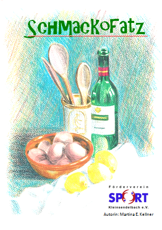

# Kochbuch "Schmackofatz"

Wir verkaufen unser im Eigenverlag herausgebrachtes Kochbuch "Schmackofatz" mit 182 Rezepten aus den Kategorien Suppen, Snacks, Hauptspeisen, Beilagen, Salate und Antipasti, Süßspeisen, Desserts, Kuchen und Torten, Brot, Plätzchen und Getränke. Alles erprobte Rezepte und viele Tipps stehen mit dabei. Außerdem gibt es noch einen Anhang mit Geheimnissen aus der Küche.
Es ist im Format A5, hat 226 Seiten, ist hochwertig fadengebunden, Cover farbig, Innenteil schwarz/weiß. Der gesamte Erlös kommt der Renovierung unserer Kabinen zu Gute.
Das Buch kostet je Exemplar 9,90 €. Sie können es im Sportheim Kleinsendelbach abholen (Öffnungszeiten siehe unten) oder wir schicken es Ihnen gerne zu (dann zzgl. 2 € für Verpackung und Versand als Büchersendung); schicken Sie dazu eine E-Mail an <a href="mailto:vorstand@sv-kleinsendelbach.de">vorstand@sv-kleinsendelbach.de</a>.

    
    Kochbuch "Schmackofatz" zu Gunsten der Kabinen-Renovierung
